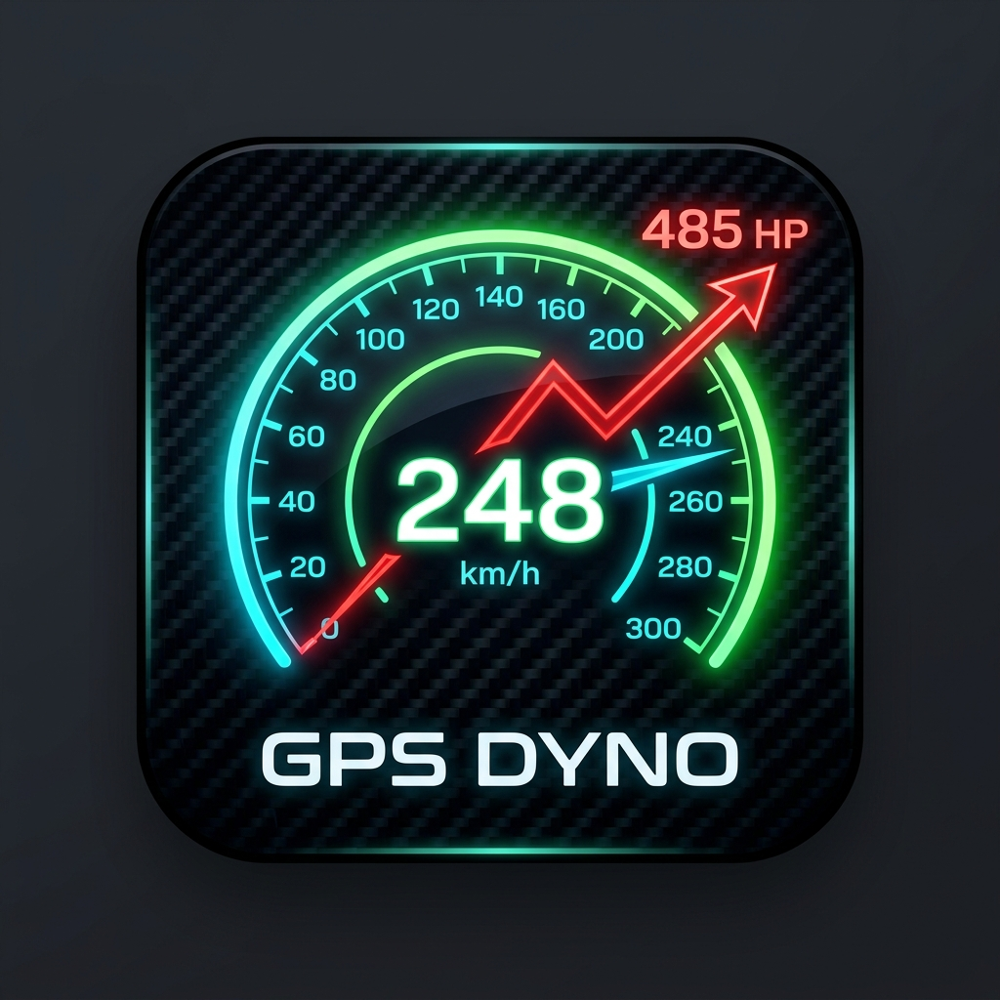

# GPS Dyno

  

GPS Dyno は、Android 端末単体で動作する高頻度（10Hz/100ms）GPS スピードメーター、走行ロガー、および動的抵抗補正を加味した **推定ホイール馬力（Estimated Wheel Horsepower）** 計測・分析アプリケーションです。

バイク（原付・スクーター含む）や自動車にスマートフォンをマウントするだけで、外部の OBD2 デバイスや ESP32 等の追加ハードウェアを一切使用せず、正確な速度計測とホイール出力のシミュレーションを行うことができます。

---

## 📥 デバッグ用 APK のダウンロード
ビルド済みのデバッグ用 APK は以下からダウンロードして実機やエミュレータにインストールできます。

*   **[gps-dyno-debug.apk (GitHubからダウンロード)](gps-dyno-debug.apk)**

---

## 💡 特徴

1.  **リアルタイム高精度メーター（表示項目の動的選択）**:
    *   円形メインメーターの表示内容を **「速度 (km/h)」「加速度 (G)」「推定馬力 (PS)」** からユーザーが自由に選択して切り替え可能。
    *   選択された項目に合わせて、メーターの数値、単位、テーマカラー（速度：ネオングリーン、加速度：ネオンシアン、馬力：ネオンオレンジ）がリアルタイムに美しく変化します。
    *   メインに選ばれなかった残り2項目は、ゲージ下部の2列サブカードに同時並行で正確に表示され続けます。
    *   `FusedLocationProviderClient` を利用した高精度 100ms（10Hz）周期の位置・速度情報取得と、5サンプルの移動平均フィルタによるノイズ低減。
    *   最高速度（MAX Speed）、GPS精度（Accuracy）をリアルタイムに視認性の高いデジタル風UIで表示。
2.  **推定ホイール馬力計測 (Estimated Wheel Horsepower)**:
    *   GPSの速度変化（加速度）に加えて、空気抵抗・転がり抵抗・道路の勾配抵抗をリアルタイム物理演算し、ホイールに伝わっている実駆動馬力（PS）を推定します。
    *   ※エンジン出力（軸馬力）ではなく、タイヤと路面が接する「ホイール馬力」を算出します。
3.  **IMUを用いた動的坂道補正**:
    *   スマートフォンの加速度センサーと重力センサーから端末のピッチ角を検知。
    *   静止状態での0点校正（キャリブレーション）機能を搭載し、スマートフォンマウント時の角度誤差を自動キャンセルして純粋な路面勾配角（$\theta$）による勾配抵抗を割り出します。
    *   **ロギング（測定）開始時の自動キャリブレーション**: 測定開始ボタン（`MEASURE START`）を押した瞬間に、現在のデバイスの傾きを自動で0点校正し、押し忘れを防止します。
    *   **平坦路測定モード（路面勾配センサーのオン/オフ）**: オートバイのようにバンク（車体の傾き）やエンジンの高周波振動が激しい環境向けに、勾配センサーをオフにする機能を搭載。オフ時は勾配を `0.0`（平坦）と仮定し、平坦な直線道路での測定により、極めて安定した正確な馬力グラフを描画できます。
4.  **バックグラウンド高頻度走行ロガー**:
    *   ロギング開始時は Android の **Foreground Service** および **WakeLock** を適用。
    *   スマートフォンの画面が消灯した状態（ポケットやタンクバッグ等に入れたスリープ状態）でも、100ms刻みの詳細な走行データを Room データベースへ漏れなく永続保存します。
    *   設定可能な制限時間（1分〜5時間）に達すると安全に自動停止します。
5.  **詳細な分析グラフ**:
    *   `MPAndroidChart` を Compose 上に統合。
    *   記録された走行ログを「速度」「加速度」「推定馬力」に切り替え、ズーム・スクロール・値のタップ表示付きでビジュアルに解析可能。
6.  **ポータブルなCSV出力**:
    *   記録した走行データを他アプリやPCへ即時エクスポート可能。
    *   Android 12〜14以降の最新セキュリティ（Scoped Storage, FileProvider）に対応。

---

## 🛠️ 物理演算アルゴリズム

最終仕事率 $P$（W）および馬力 $PS$ は以下の公式に基づいて動的に算出されます。

$$F = m \cdot a + F_d + F_r + F_g$$
$$P = F \cdot v$$
$$PS = \frac{P}{735.5}$$

### 各補正項の定義:
1.  **加速駆動力**: $m \cdot a$  
    *   $m$: 総重量（車両重量 + 乗員重量、ユーザー設定）
    *   $a$: 加速度（フィルタ適用後の速度差分より算出）
2.  **空気抵抗 ($F_d$)**: $\frac{1}{2} \cdot \rho \cdot C_d \cdot A \cdot v^2$  
    *   $\rho$: 空気密度（1.225固定）
    *   $C_d$: 空気抵抗係数（ユーザー設定）
    *   $A$: 前面投影面積（$m^2$, ユーザー設定）
    *   $v$: 速度 ($m/s$)
3.  **転がり抵抗 ($F_r$)**: $C_r \cdot m \cdot g$  
    *   $C_r$: 転がり抵抗係数（ユーザー設定）
    *   $g$: 重力加速度（9.80665）
4.  **勾配抵抗 ($F_g$)**: $m \cdot g \cdot \sin(\theta)$  
    *   $\theta$: 道路の傾斜角（IMUセンサーによりリアルタイム推定）

---

## 📦 技術スタック

*   **言語**: Kotlin
*   **UIフレームワーク**: Jetpack Compose (Material Design 3)
*   **アーキテクチャ**: Clean Architecture + MVVM + Repository Pattern
*   **非同期・データフロー**: Coroutines + Kotlin Flow
*   **データベース**: Room Database
*   **位置情報サービス**: FusedLocationProviderClient (Google Play Services)
*   **センサー処理**: SensorManager (Gravity & Accelerometer)
*   **グラフライブラリ**: MPAndroidChart
*   **バックグラウンド動作**: Foreground Service (Location Type) + WakeLock

---

## 🚀 使い方

1.  **権限の許可**:  
    アプリ起動時に位置情報の取得および通知の許可を求めてきます。画面スリープ時もロギングを継続するため、位置情報の許可設定は **「常に許可 (Allow all the time)」** を選択してください。
2.  **車両パラメータの設定**:  
    「設定」タブを開き、あなたの車両およびご自身の重量、Cd値、投影面積などを入力し「設定を保存する」を押します。
3.  **キャリブレーション（0点校正）**:  
    *   スマートフォンを車載ホルダーにしっかりと固定した後、平坦な場所でメーター画面右上にある **キャリブレーションアイコン（更新マーク）** をタップします。これで端末の固定角度が0度として校正されます。
    *   ※測定開始ボタンを押した際にも自動でキャリブレーションが実行されます。
4.  **バイク等の振動・バンク対策（推奨）**:  
    *   バイクやマウントの振動が激しい、あるいは車体がバンクして馬力表示が `0.0` に張り付いてしまう場合は、事前に「設定」タブから「路面勾配センサーを有効にする」を **オフ**（平坦路測定モード）に切り替えて保存してください。その後、平坦な直線道路で測定を行うことで、センサーエラーを完全に回避できます。
5.  **ロギングの開始**:  
    「記録上限時間」を選択し、「MEASURE START (測定開始)」をタップします。スリープ（画面OFF）状態にしても、自動で100ms周期のデータ保存が開始されます。
6.  **解析とエクスポート**:  
    「走行ログ」タブから過去のログ一覧を選択してグラフ分析を行ったり、共有アイコンからCSVファイルにエクスポートしてスプレッドシートやPC等で詳細なログ解析が可能です。

---

## ⚠️ 実機利用時の注意事項

### 📱 インストール方法

1.  端末の **「設定」→「セキュリティ」→「不明なアプリのインストール」** を許可します。
2.  上記リンクから `gps-dyno-debug.apk` をダウンロードし、端末でファイルをタップしてインストールします。
3.  「このアプリをインストールしますか？」の確認画面で **「インストール」** を押します。

> **デバッグ版 APK について**  
> このAPKはデバッグビルドです。Googleが発行した正式な署名鍵では署名されていません。  
> 実使用では問題ありませんが、Android が「不明な開発元」として警告を表示する場合があります。

---

### 🔒 バックグラウンドロギングに必要な権限設定

バックグラウンドで100ms周期の高頻度ロギングを行うために、以下の設定が必須です。

#### 1. 位置情報を「常に許可」に設定する（最重要）

| 手順 | 操作 |
|---|---|
| ① | 「設定」→「アプリ」→「GPS Dyno」→「権限」を開く |
| ② | 「位置情報」をタップ |
| ③ | **「常に許可」** を選択する |

> **⚠️ 「アプリの使用中のみ」では画面OFF時にデータが欠落します。**  
> バックグラウンドロギングには必ず **「常に許可」** を選択してください。

#### 2. 通知の許可（Android 13以降）

Android 13 (API 33) 以降の端末では、アプリ初回起動時に通知の許可ダイアログが表示されます。  
Foreground Service（バックグラウンドロギング）の動作状態をステータスバーに表示するために **「許可」** を選択してください。

#### 3. バッテリー最適化の除外（推奨）

長時間のロギング中に Android のバッテリー最適化がアプリを強制終了する場合があります。

| 手順 | 操作 |
|---|---|
| ① | 「設定」→「アプリ」→「GPS Dyno」→「バッテリー」を開く |
| ② | **「制限なし」** を選択する |

---

### 📐 精度を高めるための推奨設定

| 項目 | 推奨値 / 操作 |
|---|---|
| GPS精度モード | 「高精度」または「デバイスのみ」を推奨。「省電力」は10Hz取得ができない場合があります |
| スマートフォンの固定 | 車体に強固に固定し、走行中のガタつきを最小限にすること |
| キャリブレーション | 固定直後の平坦路で必ずメーター画面右上の更新アイコンをタップして0点校正を行う |
| 設定値の入力 | 車両重量・乗員重量・Cd値・前面投影面積・転がり抵抗係数を正確に入力することで馬力の推定精度が向上します |

---

### 🛡️ プライバシーとデータ取り扱い

*   GPS Dyno は **一切の外部サーバーへの通信を行いません**。
*   走行データ（位置・速度・馬力）はすべて **端末内のRoom データベースにのみ保存** されます。
*   データのエクスポートは、ユーザーが明示的に操作した場合のみ、CSV形式でのみ行われます。

---

# GPS Dyno (English)

  

GPS Dyno is a high-frequency (10Hz/100ms) GPS speedometer, driving logger, and **Estimated Wheel Horsepower** analysis application for Android, running entirely on the device.

By simply mounting your smartphone to a motorcycle (including scooters and mopeds) or a car, you can obtain accurate speed measurements and simulate wheel horsepower output without any external OBD2 devices, ESP32, or other hardware.

---

## 📥 Download Debug APK
You can download the pre-built debug APK from the link below to install on your device or emulator.

*   **[gps-dyno-debug.apk (Download from GitHub)](gps-dyno-debug.apk)**

---

## 💡 Features

1. **Real-time Dashboard (Selectable Display Option)**:
    * Users can dynamically toggle the central gauge between **"Speed (km/h)", "Acceleration (G)", and "Estimated Horsepower (PS)"**.
    * The gauge values, units, and neon themes (Speed: Green, Acceleration: Cyan, Horsepower: Orange) dynamically transform in real time.
    * The unselected two metrics are continuously displayed side-by-side in dual sub-cards below the main gauge.
    * Uses `FusedLocationProviderClient` for high-accuracy 100ms (10Hz) acquisition and a 5-sample moving average filter.
    * Displays MAX speed and GPS accuracy in real-time on a digital-style premium UI.
2. **Estimated Wheel Horsepower Measurement**:
    * Performs real-time physics calculations using speed changes (acceleration) along with air resistance, rolling resistance, and slope resistance to estimate actual wheel horsepower (PS).
    * ※Note: Calculates "wheel horsepower" (where tires contact the road) rather than engine crankshaft horsepower.
3. **Dynamic Slope Correction using IMU**:
    * Detects the device's pitch angle using the smartphone's accelerometer and gravity sensors.
    * Features a static zero-point calibration function to automatically eliminate mounting angle errors, isolating the actual road slope angle ($\theta$) for slope resistance calculations.
    * **Auto-Calibration on Start**: Automatically calibrates the zero-point at the exact moment the `MEASURE START` button is pressed, ensuring accurate leveling even if you forget to tap the manual button.
    * **Flat Road Measurement Mode (Slope Sensor Toggle)**: Especially for motorcycles, which experience extreme vehicle lean (bank angle) and high-frequency engine vibration, you can disable the slope sensor. When disabled, the slope is fixed at `0.0` (flat), enabling highly stable and accurate horsepower plots on flat, straight roads.
4. **High-Frequency Background Driving Logger**:
    * Employs Android **Foreground Service** and **WakeLock** during logging.
    * Ensures no data is lost by saving 100ms interval log points to the Room database even when the screen is off (pocketed or tank-bagged sleep state).
    * Safely stops automatically once the user-selected duration limit (1 min to 5 hours) is reached.
5. **Detailed Analytical Chart**:
    * Integrates `MPAndroidChart` within Jetpack Compose.
    * Offers interactive analysis of speed, acceleration, and estimated horsepower with zoom, scroll, and value tap features.
6. **Portable CSV Export**:
    * Instantly exports logged data to other apps or PCs.
    * Fully compliant with Android 12-14+ Scoped Storage and FileProvider security protocols.

---

## 🛠️ Physical Calculation Algorithm

The final power output $P$ (W) and horsepower $PS$ are dynamically calculated based on the following formulas:

$$F = m \cdot a + F_d + F_r + F_g$$
$$P = F \cdot v$$
$$PS = \frac{P}{735.5}$$

### Definition of Correction Terms:
1. **Acceleration Force**: $m \cdot a$
    * $m$: Total weight (vehicle weight + rider weight, user-configured)
    * $a$: Acceleration (calculated from velocity changes after applying filters)
2. **Air Resistance ($F_d$)**: $\frac{1}{2} \cdot \rho \cdot C_d \cdot A \cdot v^2$
    * $\rho$: Air density (fixed at 1.225)
    * $C_d$: Drag coefficient (user-configured)
    * $A$: Frontal area ($m^2$, user-configured)
    * $v$: Velocity ($m/s$)
3. **Rolling Resistance ($F_r$)**: $C_r \cdot m \cdot g$
    * $C_r$: Rolling resistance coefficient (user-configured)
    * $g$: Gravitational acceleration (9.80665)
4. **Slope Resistance ($F_g$)**: $m \cdot g \cdot \sin(\theta)$
    * $\theta$: Road inclination angle (estimated in real-time by IMU sensors)

---

## 📦 Tech Stack

* **Language**: Kotlin
* **UI Framework**: Jetpack Compose (Material Design 3)
* **Architecture**: Clean Architecture + MVVM + Repository Pattern
* **Concurrency & Streams**: Coroutines + Kotlin Flow
* **Database**: Room Database
* **Location Services**: FusedLocationProviderClient (Google Play Services)
* **Sensor Processing**: SensorManager (Gravity & Accelerometer)
* **Charting Library**: MPAndroidChart
* **Background Work**: Foreground Service (Location Type) + WakeLock

---

## 🚀 How to Use

1. **Grant Permissions**:
    When launching the app, grant location and notification permissions. To continue logging while the screen is off, select **"Allow all the time"** for location access.
2. **Configure Vehicle Parameters**:
    Navigate to the "Settings" tab, enter your vehicle and rider weights, drag coefficient (Cd), and frontal area, then tap "Save Settings".
3. **Zero-Point Calibration**:
    * Secure your smartphone in its mount, park on flat ground, and tap the **Calibration Icon (Refresh symbol)** on the top right of the speedometer screen. This calibrates the current mounting angle as 0 degrees.
    * *Note: Auto-calibration is also triggered automatically when you press the measurement start button.*
4. **Vibration & Bank Angle Protection for Motorcycles (Recommended)**:
    * If you experience high vibrations or heavy banking on a motorcycle that causes the horsepower reading to stick at `0.0`, go to the "Settings" tab, turn off "Enable Road Slope Sensor", and save. Then, conduct measurements on a flat, straight road to completely bypass sensor anomalies.
5. **Start Logging**:
    Select a logging duration limit and tap "MEASURE START". The system will capture 100ms interval logs even in standby/sleep mode.
6. **Analyze and Export**:
    Access the "Logs" tab to view interactive charts, or tap the share icon to export data to CSV for spreadsheet analysis on your PC.

---

## ⚠️ Important Notes for Real Device Usage

### 📱 How to Install the APK

1. On your device, go to **Settings → Security → Install Unknown Apps** and allow installations from your browser or file manager.
2. Download `gps-dyno-debug.apk` from the link above and tap the file on your device.
3. Tap **"Install"** when prompted.

> **About the Debug APK**  
> This APK is a debug build and is not signed with an official Google Play release key.  
> Android may show an "Unknown developer" warning — this is expected and safe to proceed.

---

### 🔒 Required Permission Settings for Background Logging

The following settings are **required** for 100ms high-frequency background logging.

#### 1. Set Location Permission to "Allow all the time" (Critical)

| Step | Action |
|---|---|
| ① | Go to Settings → Apps → GPS Dyno → Permissions |
| ② | Tap "Location" |
| ③ | Select **"Allow all the time"** |

> **⚠️ "Only while using the app" will cause data loss when the screen turns off.**  
> You MUST select **"Allow all the time"** for uninterrupted background logging.

#### 2. Allow Notifications (Android 13+)

On Android 13 (API 33) or later, a notification permission dialog will appear on first launch.  
Tap **"Allow"** to enable the Foreground Service status indicator in the notification bar.

#### 3. Disable Battery Optimization (Recommended)

Android's battery optimization may terminate the app during long logging sessions.

| Step | Action |
|---|---|
| ① | Go to Settings → Apps → GPS Dyno → Battery |
| ② | Select **"Unrestricted"** |

---

### 📐 Tips for Better Accuracy

| Item | Recommendation |
|---|---|
| GPS Mode | Use "High accuracy" or "Device only". "Battery saving" mode may not support 10Hz GPS |
| Device Mounting | Mount your phone firmly to the vehicle to minimize vibration during logging |
| Calibration | After mounting, tap the Refresh icon (top-right of the speedometer) on flat ground to zero-calibrate |
| Settings | Enter accurate vehicle weight, rider weight, Cd value, frontal area, and rolling resistance for best horsepower estimation |

---

### 🛡️ Privacy & Data Handling

* GPS Dyno **does not transmit any data to external servers**.
* All driving data (location, speed, horsepower) is stored **only in the on-device Room database**.
* Data export only occurs when explicitly triggered by the user, in CSV format only.

---

## 📄 License

This project is licensed under the MIT License - see the [LICENSE](LICENSE) file for details.
